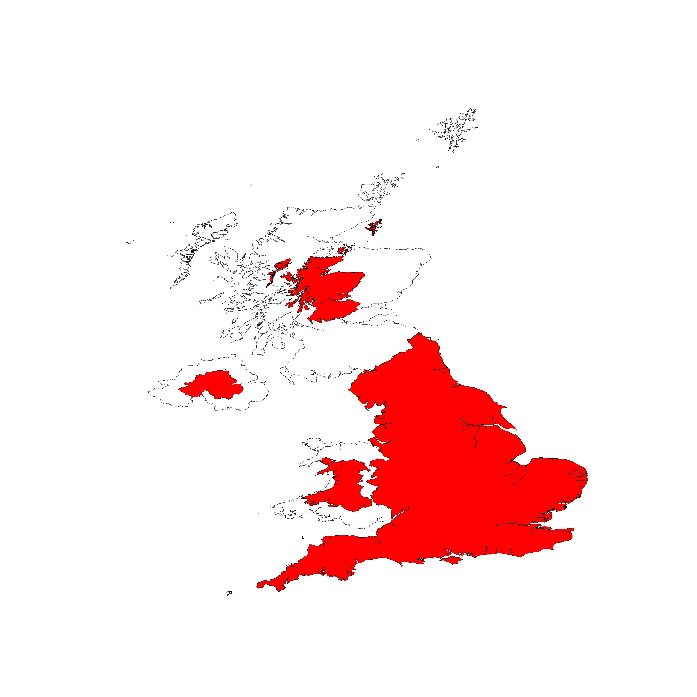

# Quick Start

`pycart` is a Python library that allows the generation of Cartograms from a 
given GeoPandas GeoDataFrame. The library is designed around a single `Cartogram` 
class, with the generation algorithms being methods of said class.

## Tutorial
Creating a Cartogram begins with ensuring that your GeoDataFrame has the following 
key fields:

| ID Field                                  |
|-------------------------------------------|
| Some identifier field e.g. Name, ISO Code |

| Value Field                                                |
|------------------------------------------------------------|
| Data to generate the cartogram around e.g. Population, GDP |

| Geometry Field                    |
|-----------------------------------|
| Geometry of the regions to modify |

The following code snippets use the following data. The Geometry field has been shortened for brevity; 
but you can download the full 5MB data file [here](tutorial/regions_pop.csv).

| Geometry               | Name             | Population |
|------------------------|------------------|------------|
| MULTIPOLYGON (((...))) | ENGLAND          | 56550138   |
| MULTIPOLYGON (((...))) | NORTHERN IRELAND | 1895510    |
| MULTIPOLYGON (((...))) | SCOTLAND         | 5466000    |
| MULTIPOLYGON (((...))) | WALES            | 3169586    |

### Loading data into `Cartogram`

Now that we have a dataset, we can load it into a [GeoDataFrame](https://geopandas.org/en/stable/getting_started/introduction.html) and 
supply it to the `Cartogram` class.

```python
from pycart import cartogram
import pandas as pd
import geopandas as gpd

df = pd.read_csv("path/to/regions_pop.csv") # Load CSV into a regular DataFrame
gdf = gpd.GeoDataFrame(df).set_crs('EPSG:3857') # Convert into a GeoDataFrame

# Load data into a Cartogram generator
cart = cartogram.Cartogram(gdf, value_field="Population", id_field="Name", geometry_field="Geometry")
```

### Generating a simple Cartogram

After creating a `Cartogram` object, we can now generate a cartogram. In this case, we use the 
`Cartogram.non_contiguous` method on the `cart` made in the previous example.

```python
from pycart import cartogram

cart = cartogram.Cartogram(gdf, value_field="Population", id_field="Name", geometry_field="Geometry")
non_con = cart.non_contiguous(position='centroid', size_value=1.0)
```

The `non_con` object is a new GeoDataFrame containing the same records as in `gdf`, with an added 
`scale` column, which determines the scaling applied to each region.

### Plotting a Cartogram

We can now plot the returned cartogram using `matplotlib`; in this example, we plot the original regions 
in white, and the newly scaled regions in red.

```python
import matplotlib.pyplot as plt

fig, ax = plt.subplots(1, figsize=(4, 4))
ax.axis('equal')
ax.axis('off')

non_con = cart.non_contiguous(position='centroid', size_value=1.0)

gdf.plot(color='w', ax=ax, alpha=0.8, zorder=0,  edgecolor='0', linewidth=0.1, legend=False)
non_con.plot(color='r', ax=ax, edgecolor='0', linewidth=0.1, legend=False)

plt.show()
```

If run correctly, the following image is produced:



Further details on the methods included with the `Cartogram` class can be found [here](reference.md).
